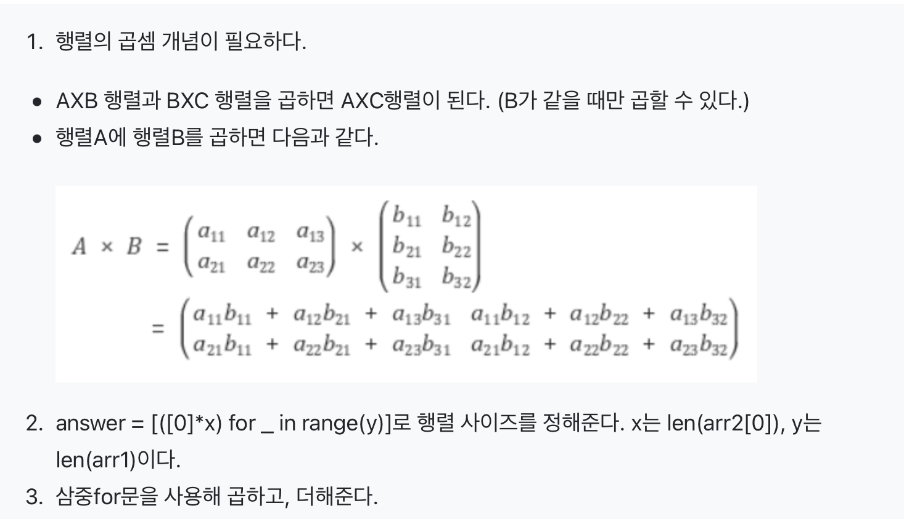

## 행렬
나는 행렬의 기초연산에 대해서 이번에 처음 알았다,,,<br/>
그래서 처음부터 해설지를 보면서 공부를 하게되었는데 여전히 아리송하다,,,

## 행렬 곱셈 과정

정답코드
```python
def solution(arr1, arr2):
    answer = [[0]*len(arr2[0]) for _ in range(len(arr1))]
    for i in range(len(arr1)): 
        lists = []
        for j in range(len(arr2[0])): 
            for k in range(len(arr1[0])): 
                answer[i][j] += arr1[i][k] * arr2[k][j]
    return answer

```